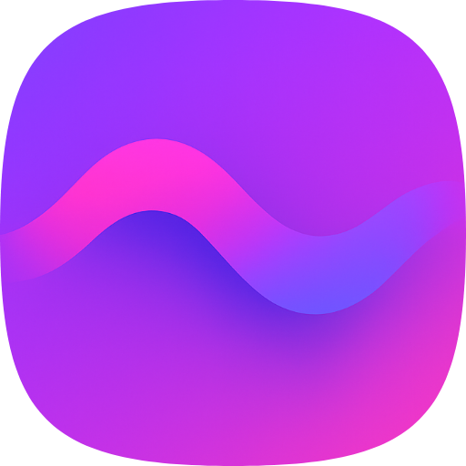
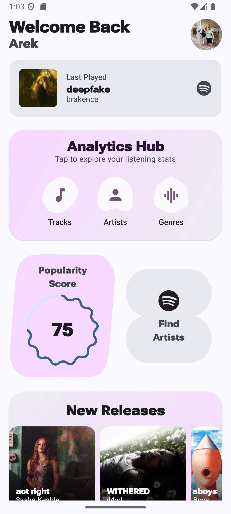
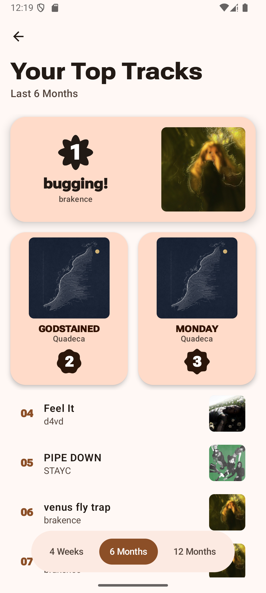
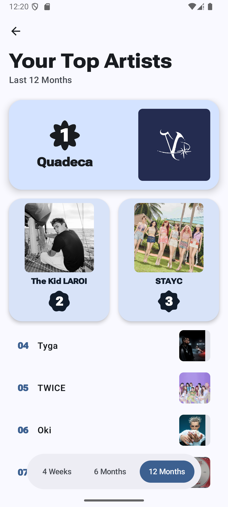
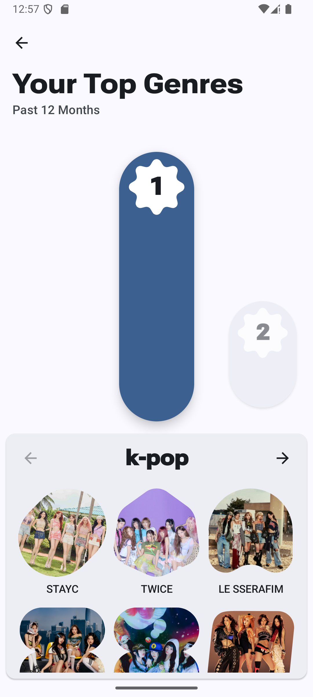
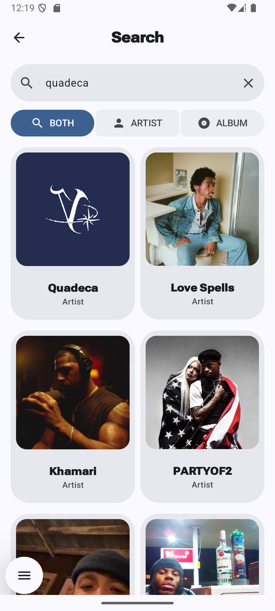
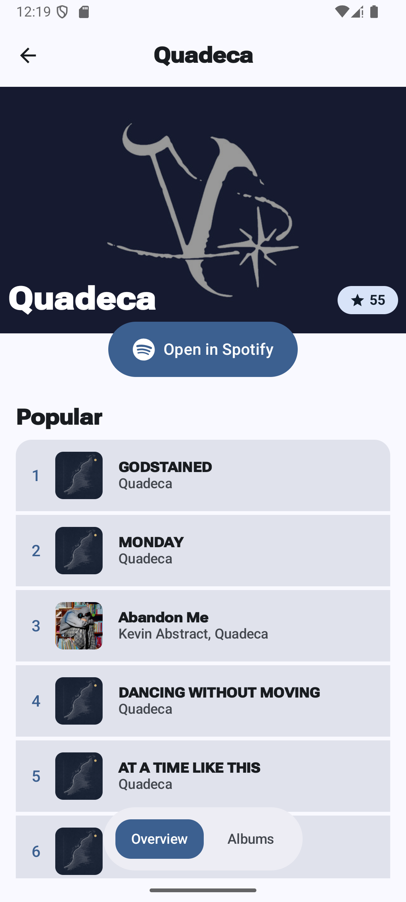
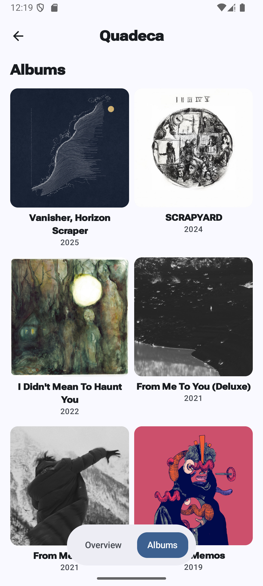

  

<h1 align="center">Cadence</h1>

Cadence is a modern Android application built to explore personal Spotify listening statistics and discover new music. This project serves as a practical exercise in building a feature-rich app using the latest Android development technologies, including Jetpack Compose and the official Spotify Android SDK.  

## 📸 Screenshots

Built with Material 3 Expressive, Cadence offers a clean and expressive interface, enhanced by dynamic animations for an intuitive feel.

  
  
  
  
  
  
  

  

## ✨ Features

- Secure Spotify Login: Authenticate using the official Spotify Android SDK for a seamless
  and secure login experience. The app gracefully falls back to a web-based flow if the Spotify app is not installed.

- Your Listening Stats: View your top tracks and top artists from different time periods: the
  last month, the last six months, and the last 12 months.
  
- Genre Deep Dive: Discover the micro-genres that truly define your musical taste. Cadence analyzes your listening history to create a ranked list of your most-played specific genres.

- Artist Pages: Dive deeper into your favorite artists with dedicated pages that showcase their top songs and full album discography, all within the app.

- Popularity Score: See where your taste falls on the spectrum from "Underground" to "Mainstream." Cadence calculates a unique popularity score based on the artists and tracks you listen to most.

- View Your Albums: Browse and explore the albums from your saved music library.

- Home Screen Widgets (Coming Soon): Keep your top tracks and artists at your fingertips with beautiful home screen widgets.

  
## 🛠️ Tech Stack & Architecture

This project follows modern Android architecture guidelines and leverages a suite of powerful libraries:

    UI: 100% Kotlin with Jetpack Compose and Material 3 expressive for a responsive user interface.

    Architecture: Follows the MVVM (Model-View-ViewModel) pattern.

    Dependency Injection: Hilt for managing dependencies and decoupling components.

    Networking: Retrofit 2 for type-safe HTTP calls to the Spotify API, with OkHttp as the HTTP client.

    Asynchronous Programming: Kotlin Coroutines and Flow for managing background threads and data streams.

    Navigation: Jetpack Navigation Compose for navigating between screens.

    Authentication: Spotify Android SDK for a native authentication flow.

## 🚀 Setup

To build and run this project yourself, you will need to provide your own Spotify API credentials:

    Get Credentials: Go to the Spotify Developer Dashboard and create a new application to get your Client ID and Client Secret.

    Configure Your App: In the Spotify Dashboard settings for your app, add the following Redirect URI: cadence-app://callback.

    Add Your Keys: Add your credentials to the local.properties file like this:

    SPOTIFY_CLIENT_ID=your_spotify_client_id_here
    SPOTIFY_CLIENT_SECRET=your_spotify_client_secret_here

    Sync the project in Android Studio, and you should be ready to build and run the app.

## 🚧 Project Status

This project is an active work in progress, with the core foundation complete and new features being built out in distinct phases.  

Phase 1: Foundation & Authentication (✅ Complete)

    Project setup with Hilt and a modern MVVM architecture.

    Secure Spotify login using the official Android SDK and persistent sessions with DataStore.

    Robust caching layer with the Room persistence library to support offline viewing and provide an instant-loading UI.

Phase 2: User Analytics Features (✅ Complete)

    Top Tracks & Artists: Implemented screens to fetch and display the user's top items.

    Genre Deep Dive: Building the logic to process and visualize the user's most-listened-to genres.

    Popularity Score: Developing the logic to calculate and display the user's "mainstream vs. obscure" score.

Phase 3: Music Library Exploration (✅ Complete)

    Artist Search: Use the Spotify SDK to search for artists. 

    Artist Pages: Creating dedicated pages to explore an artist's discography.

Phase 4: Quality & Robustness (In progress...)

    Comprehensive Testing: Write unit tests for ViewModels/repositories and UI tests to validate screen states and interactions, ensuring app stability.

Phase 5: Engagement & Home Screen Integration (In progress...)

    Stat Card Export: Develop a feature to generate and share a stylish summary image of the user's listening statistics on social media.

    Home Screen Widget: Build a widget using the Glance API to display the user's current #1 top track or artist, increasing daily engagement.

