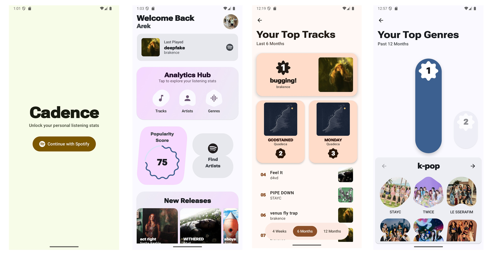
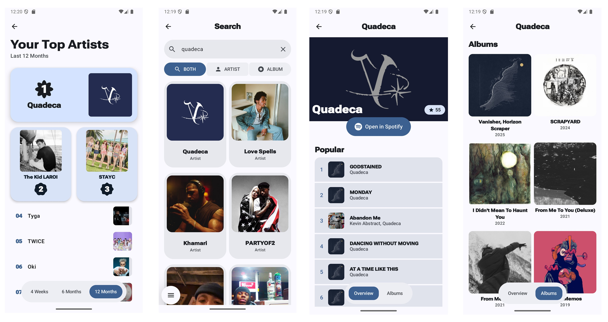

<p align="center">
  
</p>

<h1 align="center">Cadence</h1>

Cadence is a modern Android application built to explore personal Spotify listening statistics and discover new music. This project serves as a practical exercise in building a feature-rich, scalable app using the latest Android development technologies, including Jetpack Compose, Multi-Module Architecture, and the official Spotify Android SDK.

## Screenshots

Built with Material 3 Expressive, Cadence offers a clean and expressive interface, enhanced by dynamic animations for an intuitive feel.

<p align="center">
  
  
</p>  

## Features

- **Secure Spotify Login**: Authenticate using the official Spotify Android SDK for a seamless and secure login experience.
- **Your Listening Stats**: View your top tracks and top artists from different time periods: the last month, the last six months, and the last 12 months.
- **Genre Deep Dive**: Discover the micro-genres that truly define your musical taste. Cadence analyzes your listening history to create a ranked list of your most-played specific genres.
- **Artist Pages**: Dive deeper into your favorite artists with dedicated pages that showcase their top songs and full album discography, all within the app.
- **Popularity Score**: See where your taste falls on the spectrum from "Underground" to "Mainstream." Cadence calculates a unique popularity score based on the artists and tracks you listen to most.
- **Music Library**: Browse and explore the albums from your saved music library.

## Modular Architecture

Cadence has been engineered with a **multi-module architecture** to simulate a large-scale production environment. This approach ensures separation of concerns, improves build times, and enforces strict dependency boundaries.

### Module Structure

* **`:app` (Orchestrator)** The "shell" of the application. It connects all feature modules, manages the main Navigation Graph, and handles application-wide configuration (themes, dependency injection root).

* **`:feature:*` (User Journeys)** Independent, self-contained modules containing the UI and ViewModels for specific features.
    * `:feature:login`: Handles authentication state and Spotify SDK integration.
    * `:feature:home`: The dashboard hub displaying user summaries.
    * `:feature:analytics`: Detailed screens for Top Tracks, Artists, and Genres.
    * `:feature:search`: Search functionality for finding new artists.
    * `:feature:artist`: Detailed artist profiles and discography.

* **`:core:*` (Foundations)** The foundational layer containing reusable components, business logic, and data structures shared across the entire application.
    * `:core:model`: Pure Kotlin data classes and domain entities shared across the app.
    * `:core:data`: The central repository layer. Handles network calls (Retrofit), local caching (Room), and provides a single source of truth for data.
    * `:core:ui`: The Design System. Contains reusable Compose components (Buttons, Cards, TopBars) to ensure visual consistency across all features.

## Tech Stack

This project follows modern Android architecture guidelines and leverages a suite of powerful libraries:

* **Language**: 100% Kotlin
* **UI**: Jetpack Compose (Material 3 Expressive)
* **Architecture**: MVVM + Clean Architecture principles
* **Dependency Injection**: Hilt
* **Navigation**: Jetpack Navigation Compose
* **Networking**: Retrofit 2 & OkHttp
* **Async**: Kotlin Coroutines & Flow
* **Image Loading**: Coil
* **Local Storage**: Room Database & DataStore

## Setup

To build and run this project yourself, you will need to provide your own Spotify API credentials:

1.  **Get Credentials**: Go to the [Spotify Developer Dashboard](https://developer.spotify.com/dashboard/) and create a new application to get your Client ID and Client Secret.
2.  **Configure Your App**: In the Spotify Dashboard settings for your app, add the following Redirect URI: `cadence://callback`
3.  **Add Your Keys**: Add your credentials to your `local.properties` file in the root directory:

    ```properties
    SPOTIFY_CLIENT_ID=your_spotify_client_id_here
    SPOTIFY_CLIENT_SECRET=your_spotify_client_secret_here
    ```

4.  Sync the project in Android Studio, and you are ready to build!
